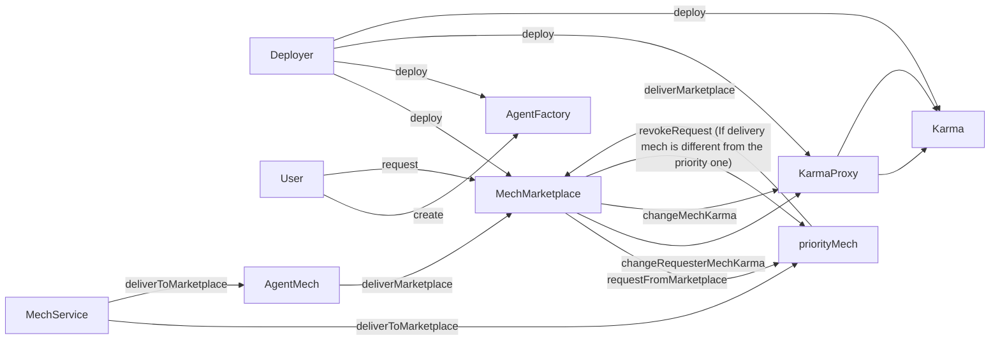

# AI Registry Mech

## Introduction

This repository contains the Agent and Mech registry.


## Development

### Prerequisites
- This repository follows the standard [`Hardhat`](https://hardhat.org/tutorial/) development process.
- The code is written on Solidity `0.8.19`.
- The standard versions of Node.js along with Yarn are required to proceed further (confirmed to work with Yarn `1.22.10` and npx/npm `6.14.11` and node `v12.22.0`).

### Install the dependencies
The project has submodules to get the dependencies. Make sure you run `git clone --recursive` or init the submodules yourself.
The dependency list is managed by the `package.json` file, and the setup parameters are stored in the `hardhat.config.js` file.
Simply run the following command to install the project:
```
yarn install
```

### Core components
The contracts, deployment scripts and tests are located in the following folders respectively:
```
contracts
scripts
test
```

### Compile the code and run
Compile the code:
```
npx hardhat compile
```
Run the tests:
```
npx hardhat test
```

## Deployment and redeployment
The deployment of contracts to the test- and main-net is split into step-by-step series of scripts for more control and checkpoint convenience.
The description of deployment procedure can be found here: [deployment](https://github.com/valory-xyz/ai-registry-mech/blob/main/scripts/deployment).

The finalized contract ABIs for deployment and their number of optimization passes are located here: [ABIs](https://github.com/valory-xyz/ai-registry-mech/blob/main/abis).
Each folder there contains contracts compiled with the solidity version before their deployment.

The list of contract addresses for different chains and their full contract configuration can be found [here](https://github.com/valory-xyz/ai-registry-mech/blob/main/docs/configuration.json).


## Deployments

| Network | AI Agent Registry    | AgentFactory    | AgentFactorySubscription   |
| :---:   | :---: | :---: | :---: |
| Gnosis | https://gnosisscan.io/address/0xE49CB081e8d96920C38aA7AB90cb0294ab4Bc8EA   | https://gnosisscan.io/address/0x4be7A91e67be963806FeFA9C1FD6C53DfC358d94   | n/a   |
| Gnosis | https://gnosisscan.io/address/0xaed729d4f4b895d8ca84ba022675bb0c44d2cd52   | n/a   | https://gnosisscan.io/address/0x910Ca843Cad6C050Faf3f84387879b2928D40370   |
| Arbitrum | tbd   | https://arbiscan.io/address/0x4a46537dd58e524d4df68275946b022ea6623f71   | n/a   |
| Arbitrum | https://arbiscan.io/address/0xa4799b083e0068732456ef45ff9fe5c683658327   | n/a   | https://arbiscan.io/address/0xd8bcc126ff31d2582018715d5291a508530587b0   |
| Polygon | tbd   | https://polygonscan.com/address/0xd421f433e36465b3e558b1121f584ac09fc33df8   | n/a   |
| Polygon | https://polygonscan.com/address/0x984cf72fde8b5aa910e9e508ac5e007ae5bdcc9c   | n/a   | https://polygonscan.com/address/0x6e7f594f680f7abad18b7a63de50f0fee47dfd06   |
| Base | tbd   | https://basescan.org/address/0x75d529fae220bc8db714f0202193726b46881b76   | n/a   |
| Base | https://basescan.org/address/0x88de734655184a09b70700ae4f72364d1ad23728   | n/a   | https://basescan.org/address/0x87c511c8ae3faf0063b3f3cf9c6ab96c4aa5c60c   |
| Celo | tbd   | https://celoscan.io/address/0x87c511c8aE3fAF0063b3F3CF9C6ab96c4AA5C60c   | n/a   |
| Celo | https://celoscan.io/address/0xE49CB081e8d96920C38aA7AB90cb0294ab4Bc8EA   | n/a   | https://celoscan.io/address/0x88DE734655184a09B70700aE4F72364d1ad23728   |
| Optimism | tbd   | https://optimistic.etherscan.io/address/0x47135D1Cf850d7Df7f7f563F300cc7022F7978a4  | n/a   |
| Optimism | https://optimistic.etherscan.io/address/0x75D529FAe220bC8db714F0202193726b46881B76   | n/a   | https://optimistic.etherscan.io/address/0x1BD1505B711Fb58C54ca3712e6BEf47A133892d9  |


## Architecture



## Acknowledgements
The registry mech contracts were inspired and based on the following sources:
- [Rari-Capital Solmate](https://github.com/Rari-Capital/solmate).
- [Autonolas Registries](https://github.com/valory-xyz/autonolas-registries).
- [Gnosis Mech](https://github.com/gnosis/mech).
- [Safe Ecosystem Safe Contracts](https://github.com/safe-global/safe-contracts).
- [OpenZeppelin Contracts](https://github.com/OpenZeppelin/openzeppelin-contracts).
